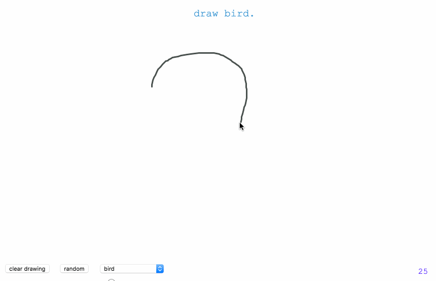

This is a JavaScript implementation of [Magenta's](https://magenta.tensorflow.org/js)
sketch-rnn model, using TensorFlow.js for GPU-accelerated inference.

**sketch-rnn** is a generative recurrent neural network capable of producing
sketches of common objects, with the goal of training a machine to draw
and generalize abstract concepts in a manner similar to humans.
This Sketch RNN model was trained on a dataset of hand-drawn sketches, each represented
as a sequence of motor actions controlling a pen: which direction to move,
when to lift the pen up, and when to stop drawing. In doing so, the
created potentially has many applications, from assisting the creative
process of an artist, to helping teach students how to draw.

Try out the interactive predict demo [here](https://storage.googleapis.com/quickdraw-models/sketchRNN/demo_tfjs/interactive_predict.html).

Read more in
[Teaching Machines to Draw](https://ai.googleblog.com/2017/04/teaching-machines-to-draw.html),
and [A Neural Representation of Sketch Drawings](https://ai.googleblog.com/2017/04/teaching-machines-to-draw.html).
